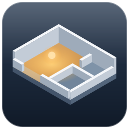
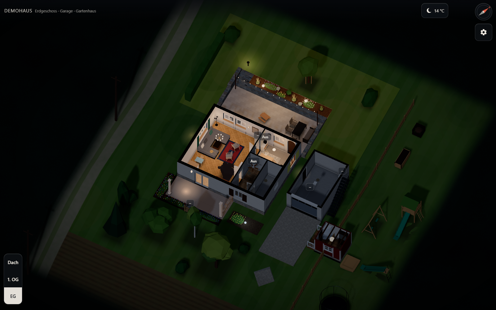
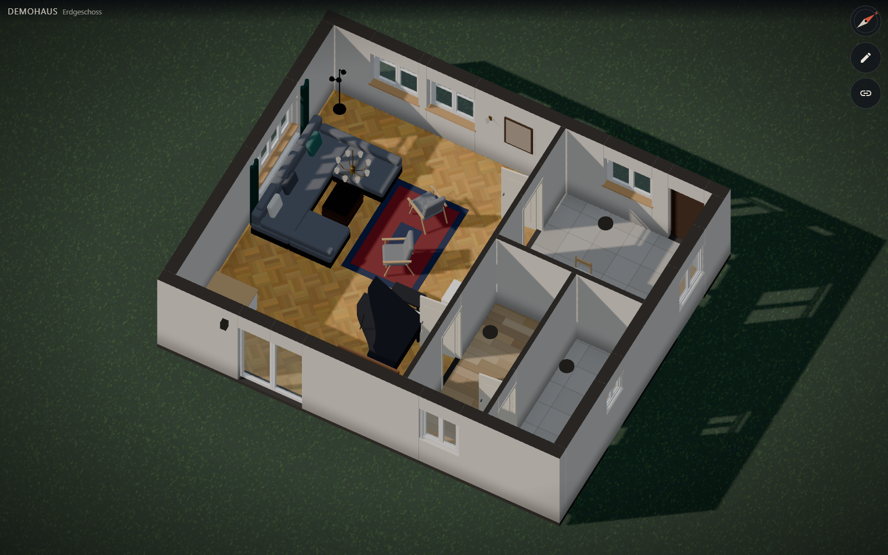
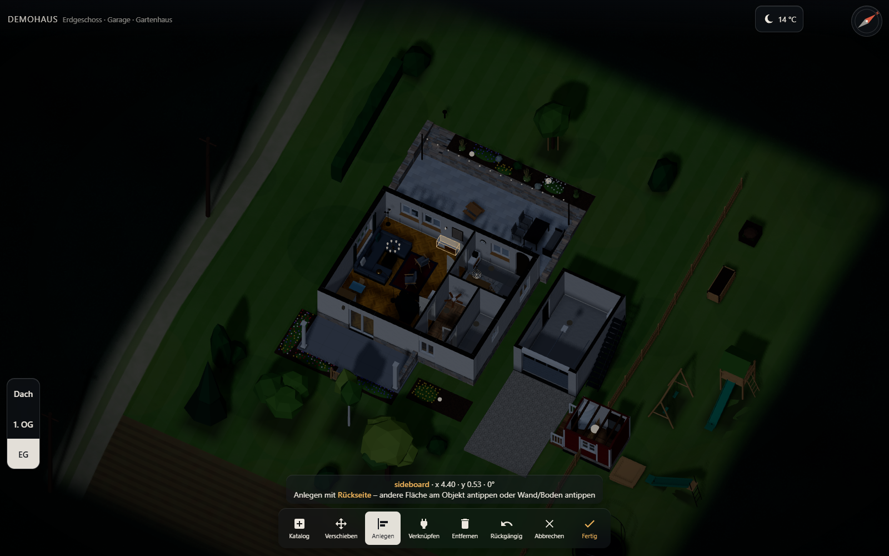
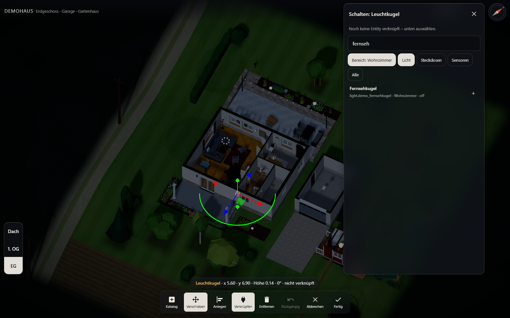

# 3D-HA-Dashboard

Ein interaktiver 3D-Grundriss deines Hauses als Panel in [Home Assistant](https://www.home-assistant.io/):
isometrische Ansicht mit abgeschnittenen Decken, Licht und Schatten nach Sonnenstand, Lampen, die in ihrer echten
Farbe leuchten, und ein Editor, mit dem du Möbel und Leuchten direkt im Modell platzierst und mit HA verknüpfst.



| Tag (Sonne aus `sun.sun`) | Editor: Anlegen an die Wand | Editor: Entity verknüpfen |
|---|---|---|
|  |  |  |

## Funktionen

- **three.js, ein JS-Bundle, offline:** keine CDNs, keine externen Requests, keine Tokens – das Panel nutzt die
  angemeldete HA-Sitzung.
- **Ohne YAML:** HACS-Integration, die das Panel selbst in die Seitenleiste einträgt.
- **Licht:** Raum antippen schaltet alle Lichter des Raums, Leuchte antippen nur diese, Leuchte **lange drücken**
  öffnet den HA-Dialog der Lampe (Farbe, Helligkeit, Farbtemperatur). Farbe und Helligkeit kommen aus HA. Das Licht wirkt nur im eigenen Raum (kein Durchscheinen durch Wände) und ist mobil-tauglich.
- **Geräte und Möbel:** Jedes Objekt lässt sich mit HA-Entities verknüpfen (Schalten, Anzeigen) – z. B.
  Waschmaschine, Kamin, PV, Staubsauger. Antippen, Doppeltippen und langes Drücken lösen wählbare Aktionen aus
  (Umschalten, HA-Dialog, Dienst, Seite, optional mit Rückfrage); ein Schild über dem Objekt zeigt den Zustand
  (z. B. „42 min“).
- **Garten:** Außenbereiche (Terrasse, Beete, Einfahrt) und Gelände mit Höhen (z. B. Südhang); Trockenmauern,
  Hochbeete und Stufen; Bäume, Sträucher, Gräser, Blumen, Gartenmöbel und Gartenleuchten (Poller, Strahler,
  Lichterkette) aus dem Katalog.
- **Wetter:** Wolken, Regen (nasse Flächen), Schnee (weiße Decke) und Nebel aus der HA-Wetter-Entity; Symbol und
  Temperatur oben, antippen zeigt die Vorhersage.
- **Himmel:** Sonne mit Schatten nach `sun.sun`, nachts Mond; Kompass mit Einnorden.
- **Touch:** für Wand-Tablets und Touchscreens gebaut (große Bedienelemente, Gesten).
- **Einstellungen (Zahnrad):** Darstellung Hell/Dunkel (Glas-Design, folgt HA), Tageszeit Automatisch/Tag/Nacht, Qualität Automatisch/Hoch/Sparsam, Bearbeiten,
  Link-Check, Version.
- **Realistisch und trotzdem flüssig:** Spiegelungen, Oberflächenstruktur, weiche Schatten. Gerechnet wird nur,
  wenn sich etwas ändert.
- **Editor:** Möbel/Leuchten antippen, mit Koordinatensystem verschieben und drehen, an Wände anlegen,
  mit HA-Entities verknüpfen (Liste aller Entities, vorgefiltert nach HA-Bereich), Gesten und Zustandsanzeige je
  Objekt einstellen, speichern.
- **Link-Check:** zeigt verknüpfte und fehlende Entities.
- **Daten statt Code:** Ein Modell (`model.yaml`) beschreibt Gebäude mit Etagen, Außenbereiche (Terrasse, Garten,
  Einfahrt) und alle Objekte; es wird zur Laufzeit geladen – Änderungen brauchen keinen Build. Versioniertes Format
  mit Schema, künftige Versionen werden automatisch migriert. Grundriss-Import aus Magicplan-PDF-Reports.
- **Mehrere Gebäude und Ebenen:** Haus, Garage, Gartenhaus; Ebenen-Knöpfe schalten zwischen den Stockwerken.

## Über HACS installieren und ausprobieren

Ohne Build, ohne YAML und ohne eigene Hausdaten – das Panel bringt das erfundene Demo-Haus mit:

1. In Home Assistant: **HACS → ⋮ → Benutzerdefinierte Repositories** → `https://github.com/zitroaen/3d-ha-dashboard`,
   Typ **Integration** → hinzufügen, dann **3D-HA-Dashboard** öffnen und **herunterladen**.
2. Home Assistant neu starten (HACS bietet das unter **Einstellungen → Reparaturen** an).
3. **Einstellungen → Geräte & Dienste → Integration hinzufügen → 3D-HA-Dashboard → OK** – oder direkt:
   [](https://my.home-assistant.io/redirect/config_flow_start/?domain=ha_3d_dashboard)

In der Seitenleiste erscheint **Haus 3D**. Ohne eigene Daten zeigt es das Demo-Haus: Seine Leuchten sind mit nichts
verknüpft und schalten **lokal**; Sonne und Mond folgen `sun.sun`. Zum Ausprobieren mit echten Lampen: Zahnrad → Bearbeiten → Leuchte
antippen → **Verknüpfen** → eigene Lampe wählen – dann schaltet sie über HA, und langes Drücken öffnet ihren HA-Dialog.
**Fertig** speichert Änderungen am Demo-Haus in deinem HA-Benutzerkonto, getrennt von den Daten deines eigenen Hauses;
**Abbrechen** verwirft sie.

**Eigenes Haus:** `model.yaml` und `textures/` nach `/config/www/ha-3d-dashboard/`
legen – das Panel findet sie dort automatisch (Seite neu laden). Was Administratoren im Editor ändern, speichert die
Integration **für alle Benutzer gleich**; Export und Import über `model.yaml`. Titel, Symbol und Datenordner lassen sich unter
**Einstellungen → Geräte & Dienste → 3D-HA-Dashboard → Konfigurieren** ändern. Wie die Daten entstehen:
[docs/SETUP.md](docs/SETUP.md).

> **Umstieg von 0.2.0:** Bis 0.2.0 war das Repo in HACS ein *Dashboard* mit `panel_custom`-Eintrag. Dort das
> Repository entfernen, den `panel_custom`-Eintrag aus der `configuration.yaml` löschen und wie oben als
> *Integration* neu hinzufügen.

## Mit Claude für das eigene Haus einrichten

Lege einen leeren Ordner für dein Haus an, öffne darin [Claude Code](https://claude.com/claude-code) und gib diesen
Prompt ein:

```text
Ich möchte das 3D-Dashboard https://github.com/zitroaen/3d-ha-dashboard für mein eigenes Haus in Home Assistant
einrichten. Arbeite in diesem leeren Ordner: Lege ihn als privates Git-Repo an, binde die Engine als Git-Submodul
unter engine/ ein (git submodule add https://github.com/zitroaen/3d-ha-dashboard.git engine) und folge dann
Schritt für Schritt engine/docs/SETUP.md. Frag mich nach allem, was du über mein Haus wissen musst (Grundriss,
Himmelsrichtung, Fotos, Lampen), und führe nichts auf meinem Home Assistant aus, ohne mich vorher zu fragen.
Meine Hausdaten bleiben in diesem privaten Ordner und gehen niemals in das öffentliche Engine-Repo.
```

Ohne Claude geht es genauso – siehe [docs/SETUP.md](docs/SETUP.md). Zum Ausprobieren ohne eigenen Grundriss:
`node engine/scripts/init-instance.mjs --demo`.

## Engine und Instanz

Dieses Repo ist die **Engine**: Code, Werkzeuge, Tests und ein erfundenes Demo-Haus (`examples/demo`). Die Daten
eines echten Hauses liegen in einer **privaten Instanz**, die die Engine als Submodul einbindet. So kann die Engine
öffentlich weiterentwickelt werden, ohne dass Daten eines Hauses im Internet landen
(`tests/privacy-guard.mjs` prüft das bei jedem Testlauf).

## Entwicklung

```bash
npm ci
npm run serve        # Vorschau mit Demo-Haus: http://127.0.0.1:8123/tests/harness.html
npm test             # Datenschutz-Check, Datenprüfung, Unit-Tests, Build, Screenshots, Bedien-Tests
```

Unter Linux/macOS einmalig `npx playwright-core install chromium` (Linux: `--with-deps`); Windows nutzt Edge.
Architektur und Regeln für Beiträge: [CLAUDE.md](CLAUDE.md). Datenmodell: [docs/DATA_MODEL.md](docs/DATA_MODEL.md) (Schema: [schema/model.schema.json](schema/model.schema.json)).

## Lizenz

MIT
